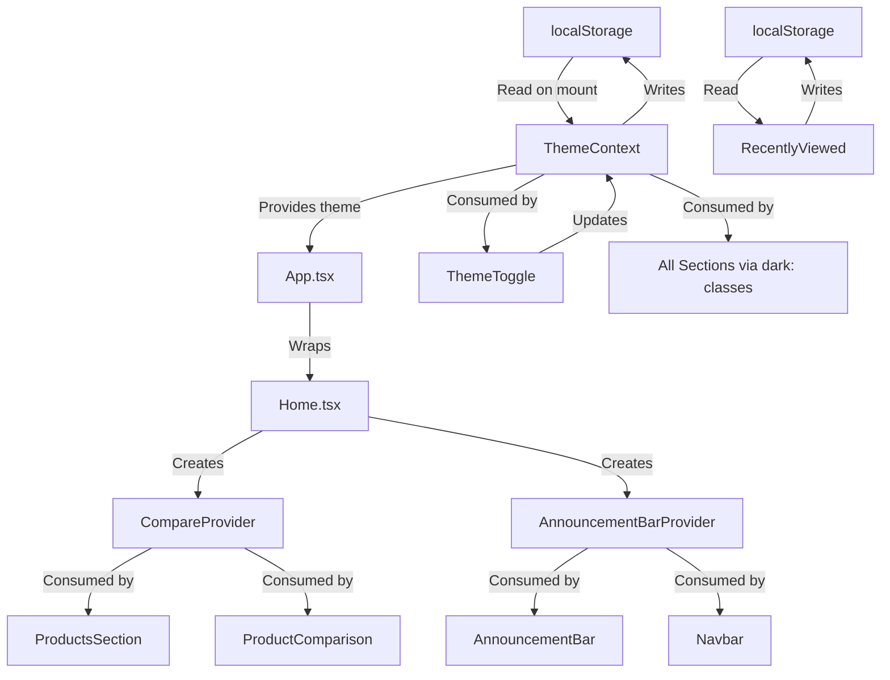

# C4 Component — State & Hooks

## Overview

| Attribute | Value |
|-----------|-------|
| **Name** | State & Hooks |
| **Type** | State Management Layer |
| **Technology** | React 19 Context API, Custom Hooks, localStorage |
| **Location** | `client/src/contexts/`, `client/src/hooks/`, `client/src/lib/` |

## Purpose

The State & Hooks component encapsulates all shared state management and reusable logic. It provides React context providers for cross-cutting concerns (theme, product comparison, announcement bar visibility) and custom hooks that abstract common patterns (scroll-triggered animations, parallax effects, dark mode detection, responsive breakpoints).

## Context Providers

| Provider | File | State Managed | Persistence |
|----------|------|---------------|-------------|
| **ThemeProvider** | `contexts/ThemeContext.tsx` | Current theme (light/dark), toggle function | localStorage (`theme` key) |
| **CompareProvider** | Defined in `pages/Home.tsx` | Selected products for comparison (max 3) | Session only |
| **AnnouncementBarProvider** | Defined in `pages/Home.tsx` | Announcement bar visibility state | Session only |

## Custom Hooks

| Hook | File | Purpose | Dependencies |
|------|------|---------|-------------|
| **useScrollReveal** | `hooks/useScrollReveal.ts` | Returns a ref and visibility boolean for scroll-triggered fade-in animations using Intersection Observer | None |
| **useParallax** | `hooks/useParallax.ts` | Calculates a vertical offset value based on scroll position for parallax effects | Window scroll event |
| **useDarkMode** | `hooks/useDarkMode.ts` | Reads and toggles dark mode class on the document element | ThemeContext |
| **useMobile** | `hooks/useMobile.tsx` | Returns boolean indicating if viewport is below mobile breakpoint | Window resize event |
| **useComposition** | `hooks/useComposition.ts` | Tracks IME composition state for input handling | Input events |
| **usePersistFn** | `hooks/usePersistFn.ts` | Returns a stable function reference that always calls the latest callback | useRef |

## Utility Functions

| Function | File | Purpose |
|----------|------|---------|
| **cn()** | `lib/utils.ts` | Merges Tailwind CSS classes using `clsx` and `tailwind-merge` |

## State Flow Diagram

## Dependencies

| Dependency | Type | Purpose |
|------------|------|---------|
| React Context API | Built-in | Provider/consumer pattern for shared state |
| localStorage | Browser API | Persistent state across sessions |
| Intersection Observer | Browser API | Scroll-triggered visibility detection |
| clsx | External | Conditional class name composition |
| tailwind-merge | External | Intelligent Tailwind class deduplication |
