# C4 Component — Skintilla Beauty (Master Index)

## Overview

The Skintilla Beauty SPA is organized into six logical component groups. Each group encapsulates a distinct area of responsibility within the single-page application. This document provides the master index of all components and their relationships.

---

## System Components

| Component | Description | Documentation |
|-----------|-------------|---------------|
| **Page Router** | Client-side routing with Wouter, page-level components, and error boundaries | [c4-component-routing.md](./c4-component-routing.md) |
| **Section Components** | The 14+ visual sections that compose the landing page (Hero, Products, Story, etc.) | [c4-component-sections.md](./c4-component-sections.md) |
| **Interactive Features** | Complex interactive components (Quiz, Routine Builder, Comparison, Before/After) | [c4-component-interactive.md](./c4-component-interactive.md) |
| **UI Primitives** | Reusable shadcn/ui components (Button, Dialog, Accordion, Tabs, etc.) | [c4-component-ui.md](./c4-component-ui.md) |
| **State & Hooks** | Context providers, custom hooks, and client-side state management | [c4-component-state.md](./c4-component-state.md) |
| **Design System** | CSS variables, Tailwind configuration, typography, and color tokens | [c4-component-design.md](./c4-component-design.md) |

---

## Component Relationships Diagram

```mermaid
graph TD
    subgraph "Page Router"
        App[App.tsx]
        Home[Home.tsx]
        NotFound[NotFound.tsx]
    end

    subgraph "State & Hooks"
        ThemeCtx[ThemeContext]
        CompareCtx[CompareProvider]
        AnnCtx[AnnouncementBarProvider]
        Hooks[Custom Hooks]
    end

    subgraph "Section Components"
        Hero[HeroSection]
        Story[StorySection]
        Products[ProductsSection]
        Ingredients[IngredientsSection]
        Bundles[BundlesSection]
        Testimonials[TestimonialsSection]
        Social[SocialFeed]
        FAQ[FAQSection]
        Loyalty[LoyaltyTeaser]
        Journal[SkinJournal]
        Footer[Footer]
    end

    subgraph "Interactive Features"
        Quiz[SkincareQuiz]
        Routine[RoutineBuilder]
        Compare[ProductComparison]
        BeforeAfter[BeforeAfterGallery]
        DetailModal[ProductDetailModal]
        ShipCalc[ShippingCalculator]
    end

    subgraph "Chrome Components"
        Navbar[Navbar]
        Announce[AnnouncementBar]
        Loading[LoadingScreen]
        ScrollTop[ScrollToTop]
        Recent[RecentlyViewed]
        ThemeToggle[ThemeToggle]
    end

    subgraph "UI Primitives"
        Button[Button]
        Dialog[Dialog]
        Accordion[Accordion]
        Tabs[Tabs]
        Sonner[Toast/Sonner]
    end

    App --> ThemeCtx
    App --> Home
    App --> NotFound
    Home --> CompareCtx
    Home --> AnnCtx
    Home --> Hero
    Home --> Story
    Home --> Products
    Home --> Ingredients
    Home --> Bundles
    Home --> Testimonials
    Home --> Social
    Home --> FAQ
    Home --> Loyalty
    Home --> Journal
    Home --> Quiz
    Home --> Routine
    Home --> Compare
    Home --> BeforeAfter
    Home --> Navbar
    Home --> Announce
    Home --> Loading
    Home --> ScrollTop
    Home --> Recent
    Home --> Footer

    Products --> DetailModal
    DetailModal --> Tabs
    DetailModal --> Button
    Bundles --> ShipCalc
    FAQ --> Accordion
    Compare --> Dialog
    Navbar --> ThemeToggle

    Hero --> Hooks
    Products --> Hooks
    Story --> Hooks
    Ingredients --> Hooks

    ThemeToggle --> ThemeCtx
    Compare --> CompareCtx
    Navbar --> AnnCtx
```

---

## Component Interaction Patterns

### Data Flow

The application uses a unidirectional data flow pattern. Product data is defined as static arrays within component files (no external API calls). State flows downward through React props and context providers. User interactions trigger local state changes or context updates that propagate through the component tree.

### Key Interaction Chains

| Trigger | Flow |
|---------|------|
| Product card click | `ProductsSection` → `ProductDetailModal` opens → Tabs render content → "Add to Cart" triggers Sonner toast |
| Quiz completion | `SkincareQuiz` step 1→2→3 → Internal state calculates recommendation → Result renders with product CTA |
| Theme toggle | `ThemeToggle` → `ThemeContext` updates → CSS variables change → All components re-render with new theme |
| Comparison select | `ProductsSection` checkbox → `CompareProvider` state updates → `ProductComparison` modal renders selected products |
| Announcement dismiss | `AnnouncementBar` X button → `AnnouncementBarProvider` sets visible=false → `Navbar` adjusts top offset |

### External Dependencies

| Component | External Dependency | Purpose |
|-----------|-------------------|---------|
| `ProductVideoHover` | Pexels CDN | Lazy-loads video on hover |
| `HeroSection` | Manus CDN | Hero background and product images |
| `SocialFeed` | Manus CDN | Instagram-style lifestyle photos |
| `StorySection` | Manus CDN | Brand lifestyle photography |
| `ThemeContext` | Browser localStorage | Persists theme preference |
| `RecentlyViewed` | Browser localStorage | Persists recently viewed product IDs |
