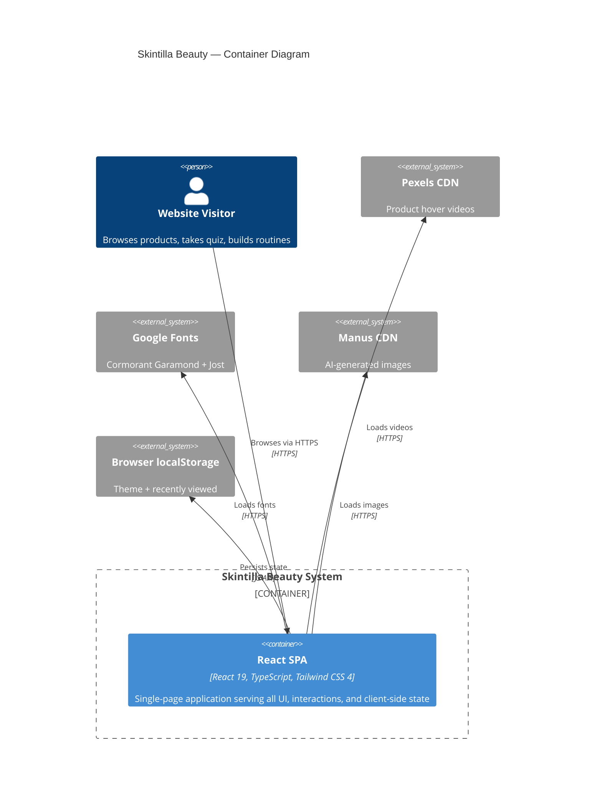

# C4 Container — Skintilla Beauty

## Overview

Skintilla Beauty is deployed as a single static web application container. There is no backend server, database, or message queue in the current architecture. All content is bundled at build time and served as static files via a CDN-backed hosting provider.

---

## Containers

### 1. Static Web Application

| Attribute | Value |
|-----------|-------|
| **Name** | Skintilla Beauty SPA |
| **Type** | Web Application (Static) |
| **Technology** | React 19, TypeScript 5.6, Tailwind CSS 4, Vite 7 |
| **Deployment** | Manus Hosting / Vercel (static file serving with SPA routing) |
| **Build Tool** | Vite with `pnpm run build:static` |
| **Output** | `dist/` directory containing HTML, JS, CSS, and static assets |

**Purpose:** This container serves the entire Skintilla Beauty experience. It is a client-side rendered single-page application that handles all routing, state management, animations, and user interactions in the browser. The build process compiles TypeScript and JSX into optimized JavaScript bundles, processes Tailwind CSS into a minimal stylesheet, and copies static assets from `client/public/`.

**Components Deployed in This Container:**

| Component | Documentation |
|-----------|---------------|
| Page Router | [c4-component-routing.md](./c4-component-routing.md) |
| Section Components | [c4-component-sections.md](./c4-component-sections.md) |
| Interactive Features | [c4-component-interactive.md](./c4-component-interactive.md) |
| UI Primitives | [c4-component-ui.md](./c4-component-ui.md) |
| State & Hooks | [c4-component-state.md](./c4-component-state.md) |
| Design System | [c4-component-design.md](./c4-component-design.md) |

---

### 2. External CDN Services (Not Owned)

These are external containers that the application depends on but does not control.

| Service | Type | Protocol | Purpose |
|---------|------|----------|---------|
| Pexels CDN | Content Delivery | HTTPS | Product video assets |
| Google Fonts CDN | Content Delivery | HTTPS | Typography (Cormorant Garamond, Jost) |
| Manus CDN | Content Delivery | HTTPS | AI-generated product and lifestyle images |

---

## Interfaces

The static web application does not expose any server-side APIs. All interactions are client-side. The application consumes external resources via direct HTTPS URL references embedded in the component code.

| Interface | Direction | Protocol | Description |
|-----------|-----------|----------|-------------|
| Browser Navigation | Inbound | HTTP/HTTPS | Users access the SPA via browser URL |
| Pexels Video Fetch | Outbound | HTTPS | Lazy-loaded video elements fetch from Pexels CDN |
| Google Fonts Fetch | Outbound | HTTPS | CSS link tag loads font files |
| Image Fetch | Outbound | HTTPS | `` elements load from Manus CDN |
| localStorage API | Internal | JavaScript | Read/write theme preference and recently viewed products |

---

## Infrastructure

### Build Configuration

The Vite configuration (`vite.config.ts`) defines the build pipeline:

- **Entry point:** `client/index.html`
- **Output directory:** `dist/` (for static build: `dist/public/`)
- **Plugins:** `@vitejs/plugin-react`, `@tailwindcss/vite`, `vite-plugin-manus-runtime`
- **Path alias:** `@/` → `client/src/`

### Deployment Configuration

**Vercel (`vercel.json`):**
```json
{
  "rewrites": [{ "source": "/(.*)", "destination": "/index.html" }]
}
```

This ensures all routes are handled by the SPA's client-side router (Wouter).

**Manus Hosting:** Deployment is managed through the Manus checkpoint-and-publish workflow. No additional configuration is required beyond the standard Vite build output.

### Scaling Strategy

As a static site, scaling is handled entirely by the hosting provider's CDN. There are no server processes to scale. The application is designed for edge delivery with aggressive caching of static assets.

### Resource Requirements

| Resource | Requirement |
|----------|-------------|
| Build Memory | ~512 MB (Vite build) |
| Build Time | < 30 seconds |
| Bundle Size | ~350 KB gzipped (estimated) |
| Runtime Memory | Browser-dependent (no server) |

---

## Container Diagram



---

## Future Containers (Planned)

When the project evolves to include e-commerce functionality, the following containers will be added:

| Container | Type | Technology | Purpose |
|-----------|------|------------|---------|
| API Server | Web Server | Express.js / Node.js | REST API for products, orders, users |
| Database | Data Store | PostgreSQL | Product catalog, user accounts, orders |
| Payment Gateway | External Service | Stripe | Payment processing |
| Auth Service | External Service | Manus OAuth | User authentication |
