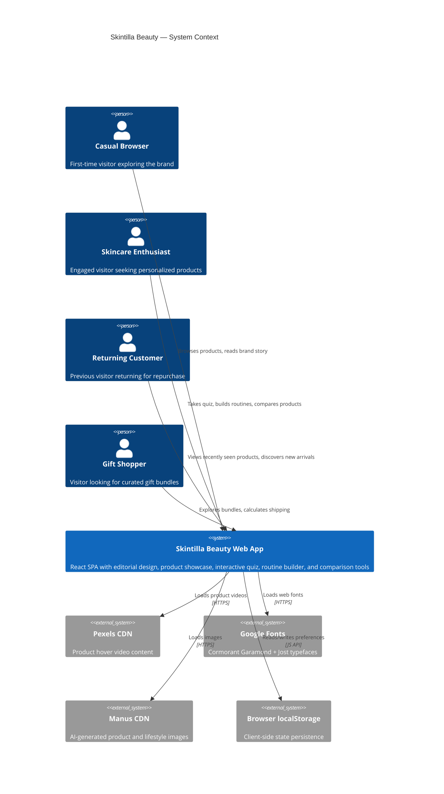

# C4 Context — Skintilla Beauty

## System Overview

**Short Description:** Skintilla Beauty is a luxury skincare brand's single-page web application that serves as both a product showcase and an interactive shopping experience.

**Long Description:** The Skintilla Beauty web application is a client-side rendered React application that presents the brand's product catalog, brand story, and interactive engagement tools through an editorial "Botanical Atelier" design aesthetic. The system enables visitors to explore products, take a personalized skincare quiz, build custom routines, compare products side-by-side, and discover curated beauty bundles. It operates as a static frontend application with no backend database, relying on external CDN services for media assets and browser localStorage for client-side state persistence.

---

## Personas

### Human Users

| Persona | Type | Description | Goals | Key Features Used |
|---------|------|-------------|-------|-------------------|
| **Casual Browser** | Human User | First-time visitor exploring the brand | Understand the brand story, browse products, assess quality | Hero section, Brand Story, Product Collection, Testimonials |
| **Skincare Enthusiast** | Human User | Engaged visitor seeking personalized recommendations | Find the right products for their skin type, build a routine | Skincare Quiz, Routine Builder, Product Comparison, Ingredients |
| **Returning Customer** | Human User | Previous visitor returning to explore or repurchase | Quick access to previously viewed products, discover new arrivals | Recently Viewed strip, New Arrivals badges, Bundles section |
| **Gift Shopper** | Human User | Visitor looking for curated gift options | Find beautifully packaged bundles at various price points | Beauty Bundles, Shipping Calculator |
| **Mobile Shopper** | Human User | Visitor browsing on a smartphone or tablet | Full-featured experience on smaller screens | Mobile drawer navigation, Sticky Add to Cart bar, responsive layouts |

### External Systems

| System | Type | Description | Integration |
|--------|------|-------------|-------------|
| **Pexels CDN** | External Service | Provides product hover video content | Direct CDN URL embedding (no API key) |
| **Google Fonts CDN** | External Service | Serves Cormorant Garamond and Jost typefaces | Link tag in HTML head |
| **Manus CDN** | External Service | Hosts AI-generated product and lifestyle images | Direct URL references in component code |

---

## System Features

| Feature | Description | Personas | Journey Link |
|---------|-------------|----------|-------------|
| **Product Discovery** | Browse the signature collection with video previews, detail modals, and ingredient transparency | Casual Browser, Skincare Enthusiast | [Product Discovery Journey](#product-discovery-journey) |
| **Personalized Recommendations** | 3-step skincare quiz that analyzes skin type and concerns to recommend products | Skincare Enthusiast | [Quiz Journey](#skincare-quiz-journey) |
| **Routine Building** | Drag-and-drop interface for assembling morning and evening skincare routines | Skincare Enthusiast | [Routine Builder Journey](#routine-builder-journey) |
| **Product Comparison** | Side-by-side comparison of 2–3 products across price, ingredients, and benefits | Skincare Enthusiast | [Comparison Journey](#comparison-journey) |
| **Bundle Shopping** | Curated beauty bundles with promotional pricing and countdown timers | Gift Shopper, Returning Customer | [Bundle Shopping Journey](#bundle-shopping-journey) |
| **Brand Storytelling** | Editorial content including brand story, Skin Journal articles, and social proof | Casual Browser | [Brand Discovery Journey](#brand-discovery-journey) |
| **Dark Mode** | Warm espresso/olive dark theme with smooth transitions and localStorage persistence | All personas | — |
| **Mobile Experience** | Full-featured mobile layout with hamburger drawer, sticky cart bar, and touch-optimized interactions | Mobile Shopper | — |

---

## User Journeys

### Product Discovery Journey

**Persona:** Casual Browser / Skincare Enthusiast

1. Visitor lands on the page and sees the Hero section with editorial imagery and a call-to-action.
2. Scrolling reveals the Brand Story section with company milestones and philosophy.
3. The Signature Collection displays 4 products with video-on-hover previews.
4. Clicking a product opens a Detail Modal with 4 tabs: Overview, Ingredients, How to Use, Reviews.
5. The visitor can add the product to their cart (toast notification confirms).
6. Recently Viewed strip at the bottom tracks browsed products for easy return.

### Skincare Quiz Journey

**Persona:** Skincare Enthusiast

1. Visitor scrolls to the Skincare Quiz section and clicks "Start Quiz."
2. Step 1: Select skin type (dry, oily, combination, sensitive, normal).
3. Step 2: Identify primary skin concerns (acne, aging, dullness, etc.).
4. Step 3: Choose preferred product texture (lightweight, rich, gel, etc.).
5. The quiz generates a personalized product recommendation with a "Shop This Bundle" CTA.

### Routine Builder Journey

**Persona:** Skincare Enthusiast

1. Visitor navigates to the Routine Builder section.
2. Two columns display: Morning Routine and Evening Routine.
3. Available products are shown in a product shelf below.
4. Visitor drags products into the desired routine slot.
5. Products can be reordered within a routine or removed.
6. The completed routine provides a summary of the selected products.

### Comparison Journey

**Persona:** Skincare Enthusiast

1. Visitor selects 2–3 products for comparison from the product collection.
2. A comparison modal opens showing products side-by-side.
3. Comparison criteria include: price, rating, value per ml, skin type suitability, key benefits, and key ingredients.
4. Each product column includes an "Add to Cart" button for direct purchase.

### Bundle Shopping Journey

**Persona:** Gift Shopper

1. Visitor scrolls to the Beauty Bundles section.
2. Three bundles are displayed with pricing, included products, and savings.
3. A countdown timer shows the remaining time for the Spring Glow Sale (15% off).
4. The Shipping Calculator widget allows the visitor to estimate delivery costs.
5. Visitor selects a bundle and proceeds to add it to their cart.

### Brand Discovery Journey

**Persona:** Casual Browser

1. Visitor reads the Brand Story section with lifestyle imagery and founding narrative.
2. The Natural Ingredients section showcases key botanical ingredients with descriptions.
3. Customer Testimonials provide social proof from real users.
4. The Before & After Gallery demonstrates product efficacy with draggable comparison sliders.
5. The Instagram-style Social Feed (#SkintillaGlow) shows community engagement.
6. The Skin Journal offers editorial beauty articles for deeper engagement.
7. The Loyalty/Rewards teaser introduces the 3-tier rewards program.

---

## External Systems and Dependencies

| System | Type | Description | Integration Type | Purpose |
|--------|------|-------------|-----------------|---------|
| **Pexels Video CDN** | Content Delivery | Hosts product demonstration videos | HTTP (direct URL) | Provides video-on-hover content for product cards |
| **Google Fonts** | Content Delivery | Serves web fonts | HTTP (CSS link) | Delivers Cormorant Garamond and Jost typefaces |
| **Manus Image CDN** | Content Delivery | Hosts AI-generated images | HTTP (direct URL) | Provides hero, product, lifestyle, and botanical imagery |
| **Browser localStorage** | Client Storage | Persists user preferences | JavaScript API | Stores theme preference, recently viewed products |

---

## System Context Diagram

---

## Related Documentation

| Document | Location | Description |
|----------|----------|-------------|
| Container Documentation | [c4-container.md](./c4-container.md) | Deployment containers and technology choices |
| Component Documentation | [c4-component.md](./c4-component.md) | Logical component breakdown and relationships |
| Design System | [DESIGN.md](../DESIGN.md) | Visual design system specification |
| Product Context | [conductor/product.md](../conductor/product.md) | Product vision, users, and roadmap |
| README | [README.md](../README.md) | Setup, architecture, and deployment guide |
